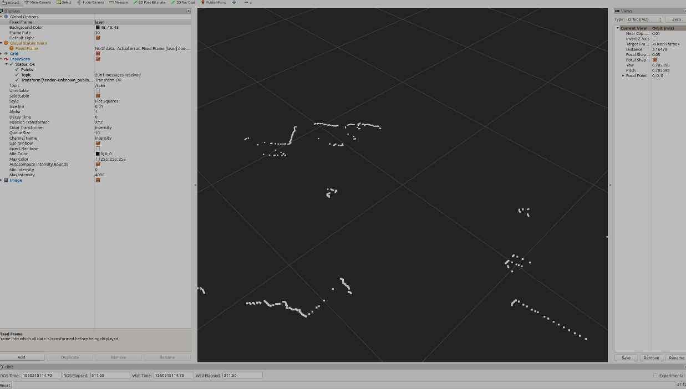

# Perception

One of the key features that differentiate robots from simple machines is the execution or adaptation of actions based upon observations of the scene around it.
In this lesson, we will be exploring one of the more ubiquitous elements of robotic perception, detection of a fiducial marker.
We will also be touching on complex detection of a human face in a stretch goal.


## April Tags

[April tags](https://april.eecs.umich.edu/software/apriltag.html) are a form of fiducial (derived from the latin word for trust) developed in one of the robotics departments at the University of Michigan.
Fiducials are physical markers which can be localised in 3D (truly 6DOF) with respect to a camera which captured them in 2D (truly 3DOF).


In this session, we will be using simple and cheap cameras to detect and view the precise position and orientation of the tags relative to the camera.
There are a limited number of USB cameras, so we will also be using the built in camera in your laptop where we can.
We will also be trying out the supplied [rosbag](http://wiki.ros.org/Bags) files for some more examples if you wish.
You will be supplied with printed April tags and a calibration board at the session.

### Preperation

You will need a driver for the camera you will be using, and the Apriltag package.
Most USB cameras and in-built laptop camera can be run with the `usb_cam` package.
We will also be using a particular ros package for calibrating your sensor; `camera_calibration`.

```bash
sudo apt install ros-noetic-usb-cam ros-noetic-apriltag-ros ros-noetic-camera-calibration
```

### April Tag Exercise

Use your USB camera to detect an apriltag!
We are using [tag36h11](https://www.dotproduct3d.com/uploads/8/5/1/1/85115558/apriltags1-20.pdf), these are provided.
The exercise is layed out below.

- [ ] Create a launch file to start your usb camera, check that it is working with RVIZ
- [ ] Calibrate your camera with a checkerboard and http://wiki.ros.org/camera_calibration/Tutorials/MonocularCalibration
- [ ] Add the apriltag node to your launch file and configure it (tip: you need to configure the node to subscribe to your camera publisher and add your apriltag to the config file)
- [ ] Add a static tf from the map to camera at the height your camera is above the ground (a tape measure is provided)
- [ ] View the detection in RVIZ (the image)
- [ ] View the detection in RVIZ (the tf)

## Stretch goal
 
If the above is completed in the session we will be supplying [Hokuyo](https://www.hokuyo-aut.jp/search/single.php?serial=166) LiDARs, depth camera and usb cameras, and we will set up an face detection and position estimation system.
We will then build our own python node to output the location of detected people.



This stretch goal assumes you are familiar with:
* Python 
* [Subscribing and Publishing Topics](http://wiki.ros.org/ROS/Tutorials/WritingPublisherSubscriber%28python%29)
* Rosbag playing

There are limited Hokuyos available so [rosbag](http://wiki.ros.org/Bags) files will be supplied for students to work with until they are ready to test their software.

If you are using either the USB Cameras or the Hokuyo LiDAR you need to have a USB Type A socket.
 
### Gettin ready

If you're using a hokuyo, install the `urg_node` package.
Otherwise, install the appropriate node for your LiDAR / depth sensor.

### LIDAR face detection

- [ ] Create a launch file that starts the LiDAR and the usb camera (or use the provided rosbag) *hint: can you access the device as your user?*
- [ ] View the outputs of the camera and LiDAR / Depth Sensor in RVIZ
- [ ] Write a python node that subscribes to the image and LiDAR topics
- [ ] Use OpenCV to perform face detection on the image
- [ ] Calculate the angles of the LiDAR that overlap the cameras vision (the lidar is 270 degrees, single layer).
  - This can be done roughly, even with your hand if you are using the hardware.
  - *It would be better to do this in the urg_node configuration, limiting the scan angle, rather than selecting a subset of the array... but each will work.*
- [ ] Take the center of detected objects and roughtly figure out the angle they are at 
- [ ] Using that angle to get the LiDAR distnace
- [ ] Output the object type and distance as text

<details>
<summary>Click for a hint if you are having trouble with your sensor</summary>

Usually googling the device and ROS will bring up the driver.
 
If you cannot open the LiDAR:
https://answers.ros.org/question/286646/error-connecting-to-hokuyo-could-not-open-serial-hokuyo/

Other resources:
https://answers.ros.org/question/251060/how-to-use-an-usb-hokuyo-laserscanner-in-ros-kinetic/

</details>
<br/>

### Further stretch

- [ ] Publish the tf of the detected object
