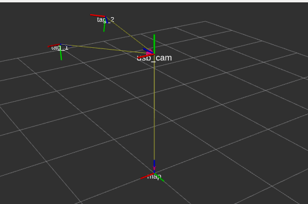

# Perception

One of the key features that differentiate robots from simple machines is their ability to act based on observations of the environment.
In this lesson we will explore two common tasks in robotic perception: Detecting and tracking visual fiducial markers, and in a stretch goal, human faces.


## Visual Fiducials

Derived from the latin word for trust, _fiducials_ are physical markers that can be used as a point of reference. When the size and shape of visual fiducials are known, they can be localised in 3D with respect to a calibrated 2D camera.

[April Tags](https://april.eecs.umich.edu/software/apriltag.html) are a popular set of visual fiducials developed at the University of Michigan. In this workshop we will use the April Tag group `tag36h11` (download [here](./resources/tag36h11_200mm_id_000-049.pdf), source [here](https://github.com/rgov/apriltag-pdfs)).

## April Tags

In this session, we will use inexpensive cameras to detect and track the relative position and orientation of April Tags. Start by installing the April Tags ROS package: 

```bash
sudo apt install ros-$ROS_DISTRO-apriltag-ros
```

There are two ways to source camera data for this exercise: Live data from a USB camera, or prerecorded data from a ROS bag file. 

### Option 1: Live USB camera

Choose either use your laptop's camera, or borrow a USB camera from a mentor. To integrate the camera into ROS, you'll need to install the correct driver; fortunately, most USB cameras and in-built laptop cameras work with the `usb_cam` package. We'll also need the `camera_calibration` package to calibrate your camera. Install these packages: 

```bash
sudo apt install ros-$ROS_DISTRO-usb-cam \
                 ros-$ROS_DISTRO-camera-calibration
```

#### Steps:
1. Create a launch file that loads the USB camera driver.
1. Check that the camera's images are visible with `rviz`. 
1. Locate a camera calibration checkerboard 
1. Calibrate your camera with a checkerboard by following [these instructions](http://wiki.ros.org/camera_calibration/Tutorials/MonocularCalibration).
1. Source one or more of the April Tags that have been distributed around the workshop. 


### Option 2: Prerecorded bag file

Ask one of the mentors for a copy of the ROS bag file `april_tag.bag`. 

#### Steps:
1. Create a launch file that plays the ROS bag file.
1. Set the bag file to loop repeatedy. 
1. Check that the camera's images are visible with `rviz`. 
1. Explore how the camera calibration is stored in the bag file. 

### April Tag Exercise

Once you have sourced camera data from either a live camera or bag file:

1. Add the April Tag node to your launch file and configure it (Tip: you will need to configure the node to subscribe to your camera publisher and add your April Tag ID to a configuration file)
1. Add a static `tf` from the map to camera at the height your camera is above the ground.
1. View the image topic showing the tag detection in `rviz`.
1. View the `tf` tree in `rviz`, it should look like this: 




## Stretch goal
 
The stretch goal is to create a face detection and position estimation system as a Python node. It assumes you are familiar with:
* Python 
* [Subscribing and Publishing Topics](http://wiki.ros.org/ROS/Tutorials/WritingPublisherSubscriber%28python%29)
* Playing ROS bags

Ask a mentor for the `face_detection.bag` file, which contains lidar and USB camera data. The lidar sensor provides range-bearing measurements over a 270 degree horizontal field of view. 


#### Steps:

1. Create a launch file that plays the ROS bag (it makes it easier if you loop the bag).
1. View the outputs of the camera and lidar (or depth sensor) in `rviz`.
1. Calculate the range of lidar bearings that overlap the camera's view.
1. Write a Python node that subscribes to the image and lidar topics.
1. Use OpenCV to perform face detection on the image.
1. For each face detected, calculate its range and bearing in the latest lidar scan based on the face centroid.
1. Output the object type, range and bearing
1. Stretch: Publish the `tf` of the face detection
